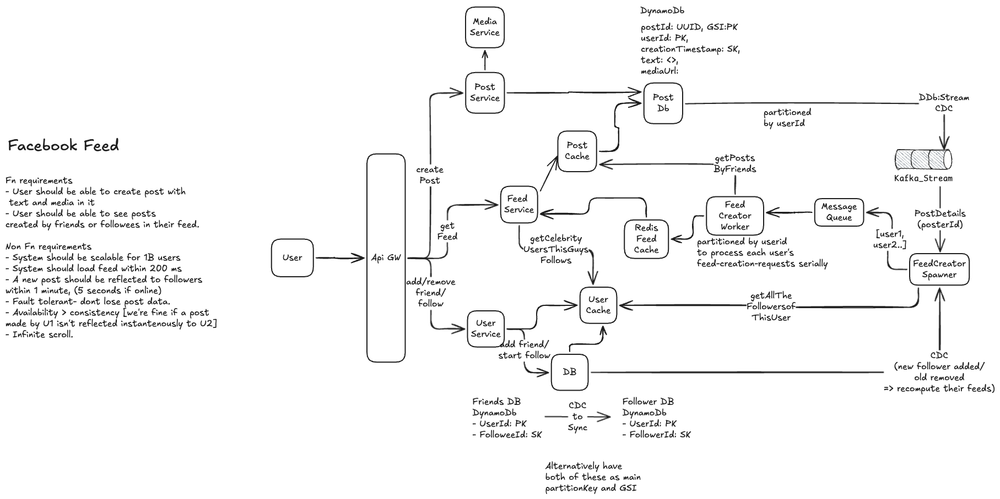

### Dive deep
1. How will you enable fast timeline rendering at scale?
2. How will you handle scatter gather latency if user is following celebrities?
3. How would you shard the systems?
4. How would you provide large video file uploads?
5. How would you protect latency from suffering due to buffering of large videos?
6. How would you handle loading 5 thousands followers for a user?
7. Would you use pull CDN vs push CDN? What is the caching strategy here? what is the key? How do you compare?
8. How do you ensure not losing the data?

### Design

